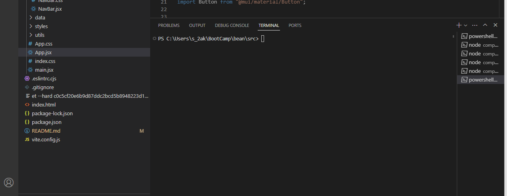
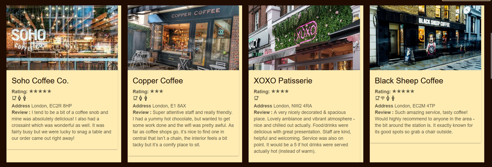
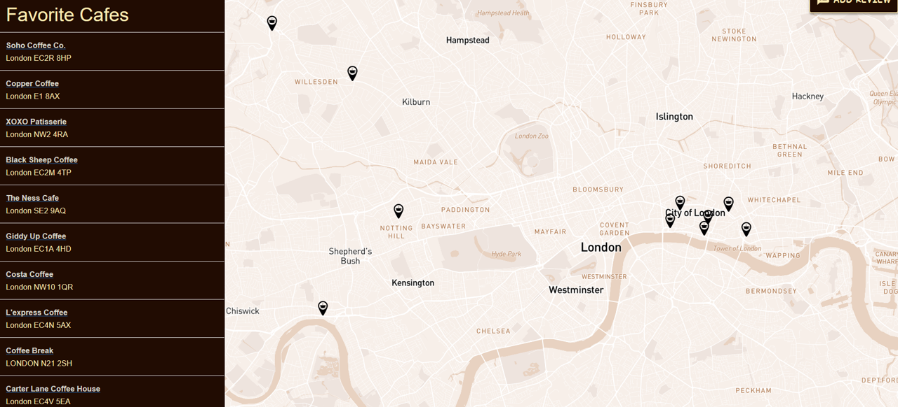
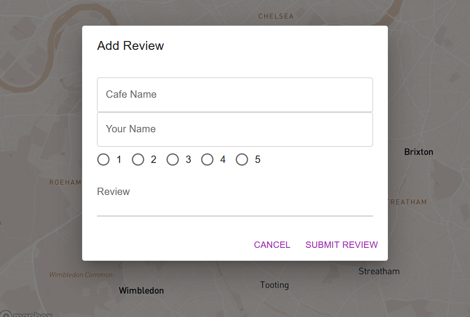

# "Bean : Your Guide to Coffee Culture"

  Welcome!!!

## Table of Contents:
* [Introduction](#introduction)
* [Installation](#installation)
* [Resources](#resources)
* [License](#license)

## Introduction

 Bean Website is a user-friendly and feature-rich platform designed to help coffee enthusiasts discover, explore, and share their favorite coffee shops. Whether you're searching for the perfect spot to enjoy your morning brew or looking to share your latest coffee adventure with friends, our application has you covered.

 ### Key Features:

- Comprehensive Coffee Shop Listings: Explore a curated selection of coffee shops in your area, complete with detailed information and user reviews.

- User Reviews and Ratings: Read honest reviews from fellow coffee lovers and share your own experiences to help others make informed decisions.

- Responsive Design: Enjoy a smooth and intuitive browsing experience across all devices, whether you're on your desktop, tablet, or smartphone.

# Installation

1. To get started with this project, you can clone the repository to your local machine.
2. Navigate to the project directory
3. Install the required software components - npm install, npm run dev.
4. Start the application

# Resources 

Here are some useful resources related to this project:

- [W3C HTML Specification](https://www.w3.org/TR/html52/): The official HTML specification by the World Wide Web Consortium.

- [Stack Overflow](https://stackoverflow.com): Get answers to common questions and issues related to this project.

- [GitHub Issues](https://support.github.com/features/issues): Report issues and request assistance.

- [Material Ui](https://mui.com/material-ui/): Material Ui.

- [React Icons - Ionicons 4](https://www.npmjs.com/package/react-icons): React Icons - Ionicons 4.

# License

This project is licensed under the MIT License. See the [LICENSE](LICENSE) file for details.

#### Support 

If you have any questions or need assistance, feel free to reach out to the team.

> [!URL]

- [Deployed application](https://65cd18d422d96517089762e8--iridescent-travesseiro-830f06.netlify.app/) : Netlify.

- [Git Repository](https://github.com/Gloal/bean): Git Hub Repo.

Thank you for having a look.

## Copyright

All Rights Reserved @Bean Cafe Reviews Pvt. Ltd.